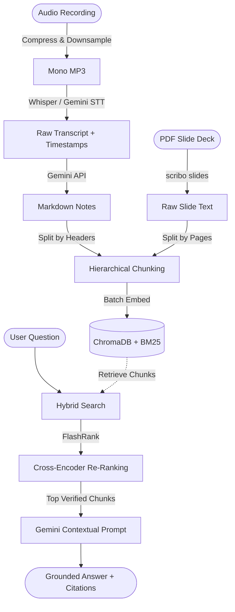

# Scribo

**Scribo** is an academic knowledge engine and ingestion pipeline designed to process lecture recordings and slide decks into structured LaTeX Markdown notes, indexing them for multi-lecture revision and grounded question answering (RAG).

The repository is organized as a modern **Monorepo**:
- **`backend/`**: Python engine containing the audio ingestion pipeline, Gemini synthesis, local ChromaDB vector store, RAG query engine, CLI tools, and FastAPI backend.
- **`frontend/`**: Next.js web application featuring a dark-themed glassmorphism interface, interactive LaTeX math rendering, and a real-time RAG study assistant.

---

## Features

- **Audio Compression & Preprocessing**: Converts multi-channel recordings (`.m4a`, `.aac`, `.wav`, `.mp3`, `.flac`, `.ogg`) into single-channel mono MP3 at 32-48 kbps using `ffmpeg`/`pydub`.
- **Two-Stage Audio to Transcript to Notes Pipeline**:
  1. Extract verbatim transcripts with exact `[MM:SS]` segment timestamps using **Whisper** (Groq / OpenAI) or **Gemini STT**.
  2. Synthesize structured academic notes from the extracted transcript using **Gemini**.
- **Advanced RAG Engine**:
  - **Hierarchical Chunking**: Markdown chunker that prepends ancestral section paths to preserve deep context and timestamp metadata.
  - **Hybrid Search**: Fuses dense vector search (ChromaDB + `gemini-embedding-2` in batches) with lexical search (BM25) using Reciprocal Rank Fusion (RRF) for precise technical retrieval.
  - **Cross-Encoder Re-Ranking**: Uses FlashRank to re-score candidate chunks and filter out irrelevant noise before passing context to the LLM.
  - **Grounded Generation**: Inline citations linking directly to exact audio segments (`[Course - Lecture @ MM:SS]`).
- **Interactive Web Interface**:
  - Split-screen workspace (interactive LaTeX notes on the left, RAG chat assistant on the right).
  - Glassmorphic dark UI tailored for distraction-free studying.

---

## Quickstart

### 1. Setup Python Backend & CLI

```bash
# Create and activate virtual environment
python3 -m venv .venv
source .venv/bin/activate

# Install backend dependencies & editable package
pip install -r backend/requirements.txt
pip install -e backend/ --no-deps
```

Configure backend environment variables:
```bash
cp backend/.env.example backend/.env
```
Add your `GEMINI_API_KEY` (and optional `GROQ_API_KEY` / `OPENAI_API_KEY` for Whisper STT) to `backend/.env`.

### 2. Setup Next.js Frontend

```bash
cd frontend
npm install
cp .env.example .env.local
cd ..
```

---

## Running the Web Application

To use the interactive web UI, run both the FastAPI backend and Next.js frontend:

**Terminal 1: FastAPI Backend**
```bash
cd backend
../.venv/bin/uvicorn api.main:app --reload --port 8000
```

**Terminal 2: Next.js Frontend**
```bash
cd frontend
npm run dev
```

Open [http://localhost:3000](http://localhost:3000) in your browser!

## Architecture & Flowchart



---

## Step-by-Step Guide: Parsing an Audio Lecture

To process a lecture recording into timestamped transcripts, structured LaTeX markdown notes, and vector index:

### Step 1: Activate the Virtual Environment
Ensure you have activated the virtual environment where `scribo` is installed:
```bash
# From the repository root
source .venv/bin/activate

# Or if you are inside the backend/ directory:
source ../.venv/bin/activate
```

> **Tip**: If `scribo` shows `zsh: command not found: scribo`, ensure you ran `pip install -e backend/ --no-deps` while the `.venv` is active, or invoke it directly using `.venv/bin/scribo` (from repo root).

### Step 2: Verify Setup & API Keys
Confirm your environment and API keys are ready:
```bash
scribo info
```

### Step 3: Run the Ingestion Pipeline
Execute `scribo process` with your course ID, lecture ID, audio path, and optional lecture title/keywords:

```bash
scribo process \
  --course eng448 \
  --lecture lec03 \
  --audio "Munda Languages - ENG448.m4a" \
  --title "Munda Languages" \
  --keywords "Munda, Santali, Mundari, Austroasiatic, infixation, phonology"
```

#### Pipeline Options:
| Flag | Description | Required | Example |
| :--- | :--- | :---: | :--- |
| `-c, --course` | Course identifier code | Yes | `eng448`, `cs101` |
| `-l, --lecture` | Lecture identifier | Yes | `lec01`, `lec02` |
| `-a, --audio` | Path to audio file (`.m4a`, `.aac`, `.wav`, `.mp3`) | Yes | `"./lecture.m4a"` |
| `-t, --title` | Title of the lecture | No | `"Phonology of Dravidian Languages"` |
| `-k, --keywords` | Technical keywords/jargon hints | No | `"morphology, retroflex, SOV"` |
| `-p, --provider` | STT provider (`gemini`, `groq`, `openai`) | No | `gemini` (default from `.env`) |
| `-m, --model` | Gemini synthesis model override | No | `gemini-3.6-flash` |
| `--compress / --no-compress` | Whether to compress audio before STT | No | Defaults to `--compress` |

### Step 4: Access Generated Artifacts
Once ingestion finishes, the generated assets are saved under `backend/data/courses/<course_id>/`:
- **Synthesized Notes**: `backend/data/courses/<course_id>/lecture_<lecture_id>.md`
- **Plaintext Transcript**: `backend/data/courses/<course_id>/lecture_<lecture_id>_transcript.txt`
- **Timestamped JSON Segments**: `backend/data/courses/<course_id>/lecture_<lecture_id>_transcript.json`
- **Metadata**: `backend/data/courses/<course_id>/lecture_<lecture_id>_meta.json`

### Step 5: View Notes or Query via RAG
```bash
# View the synthesized notes in your terminal
scribo view --course eng448 --lecture lec03

# Query across ingested lectures using Grounded RAG
scribo ask --course eng448 "Explain the noun incorporation mechanism in Munda languages"

# List all ingested lectures in the course
scribo list --course eng448
```

---

## CLI Reference Summary

```bash
# Check system and API key status
scribo info

# Full ingestion pipeline
scribo process -c eng448 -l lec01 -a "/path/to/lecture.m4a" -t "Dravidian Languages"

# Extract text from a lecture slide deck (PDF)
scribo slides --course eng448 --lecture lec01 --pdf "/path/to/slides.pdf"

# Extract transcript only
scribo transcribe --course eng448 --lecture lec01 --audio /path/to/lecture.m4a

# Synthesize notes from an existing transcript file
scribo synthesize --course eng448 --lecture lec01 --transcript /path/to/transcript.txt --title "Lecture 1"

# Manually re-index notes into ChromaDB
scribo index --course eng448

# Grounded RAG question answering
scribo ask --course eng448 "What is zero copula?"

# List courses and lectures
scribo list --course eng448

# Terminal viewer for notes and transcripts
scribo view --course eng448 --lecture lec01
scribo view --course eng448 --lecture lec01 --transcript
```

---

## Testing

The backend test suite is fully isolated and mocked to ensure zero API token consumption:

```bash
.venv/bin/pytest backend/tests/
```
